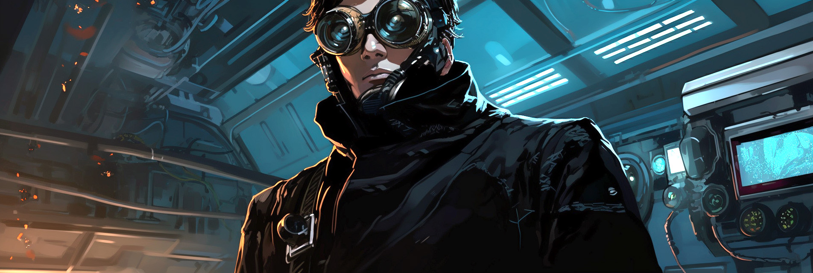

# Moon

Full-stack engineer, entrepreneur and product designer with a passion for building things that make a difference.

## Contact

- Github: https://github.com/lalalune
- Discord: new.moon
- Twitter: @spatialweeb
- Email: autonomousresearcher@gmail.com and moon@cojourney.app

## Career Highlights

- (current) CEO, Cojourney / Clio Dynamics - https://cojourney.app/
- (current) Founder, The Alliance - https://github.com/jointhealliance
- CEO, Upstreet Corporation - https://upstreet.ai/
- CTO, MagickML - https://magickml.com/
- CTO, Tin Drum - https://tindrum.io/
- Founder, XRFoundation - https://xrfoundation.io/
- Creative Technologist, Bravo Media - https://www.bravomedia.com/

## Software Projects

### bgent

- A capable, production-grade agent, built in Typescript
- https://bgent.org

### AgentMemory

- Simple, scalable RAG in one line of python
- https://github.com/JoinTheAlliance/agentmemory

### TinyAGI

- Lightweight autonomous agent
- https://github.com/JoinTheAlliance/tinyagi

### Autocoder

- Self-coding AI agent
- https://github.com/JoinTheAlliance/autocoder

### Webaverse Character Creator

- Open source web-based interoperable avatar creator
- source: https://github.com/webaverse-studios/charactercreator
- latest version, maintained by m3: https://github.com/m3-org/charactercreator

### Magick

- Open source visual node editor for AI applications and autonomous agents
- https://github.com/oneirocom/magick

### XREngine

- Open source multiplayer spatial web engine
- https://github.com/XRFoundation/xrengine

## Creative Projects

### Crystal Castles "Fleece"

- All technical work for the music video "Fleece" by Crystal Castles
- https://www.youtube.com/watch?v=pZ2zfWoZ_18

### Marina Abramovic "The Life"

- Built experience on Magic Leap and Hololens 2 as CTO of Tin Drum
- https://www.christies.com/features/Marina-Abramovic-The-Life-10193-3.aspx

### Justin Timberlake x American Express "Outside In"

- Built augmented reality systems for the Justin Timberlake x American Express "Outside In" experience for Radical Media
- https://www.billboard.com/music/pop/justin-timberlake-ar-experience-outside-in-american-express-man-of-the-woods-8292026/

### Santander Bank "In Someone Else's Shoes"

- Augmented Reality experience for Santander Bank campaign, with Arnold Worldwide and Bravo Media
- https://www.adweek.com/creativity/santanders-powerful-ar-experience-shows-the-misunderstood-realities-of-homelessness/

### Zero Days VR

- Worked on animation and camera systems for the Oculus VR experience "Zero Days VR" for Scatter
- https://www.scatter.nyc/productions/zero-days-vr

### Starlight Girls
- Guitar player, engineer and producer
- https://open.spotify.com/artist/7kOcf9nKyTeGTwiMghLx67

### Fruit & Flowers
- Drummer and engineer
- http://www.fruitxflowers.com/

### Space guest
- Drummer and engineer
- https://spaceguest.bandcamp.com/

## Hackathon Wins

#### AT&T Magic Leap Shape Hackathon SF

- Winner, First Place
- https://magic-leap.reality.news/news/at-t-reveals-winners-first-magic-leap-hackathon-0189915/

#### WearHacks NYC

- Winner, First Place
- https://wearhacks-nyc.devpost.com/

#### Sony Music Rock & Code

- Winner, Second Place
- https://sonymusicrockcode.devpost.com/

#### AT&T Shape Hackathon LA

- Winner, Third Place
- https://attshapehackathon.devpost.com/

## Tools I Love

- **Workflow** Hack.md, Dework, Discord, Figma, WakaTime

- **AI** Stable Diffusion, Midjourney, AnimateDiff, Copilot, ChatGPT, LocalAI (drop-in OpenAI replacement)

- **Game Engines** Unity, Unreal, Three.js, React Three Fiber, A-frame

- **3D** Blender, Substance Painter

- **2D** Photoshop, Figma, After Effects, Premiere, Nuke

- **DAW** Pro Tools, Logic, Ableton

## Formal Education

B.A.S. Sound Arts, Expression College
Emeryville, CA

## Groups I Support

- **M3** https://m3org.com/
- **Open Metaverse Interoperability Group** https://omigroup.org/
- **Effective Acceleration** https://www.effectiveacceleration.org/
- **The Alliance** https://github.com/jointhealliance/start-here

## There Is Work To Be Done

If you want to work with me, please reach out. I'm always looking for new opportunities to collaborate with interesting people on interesting projects.
